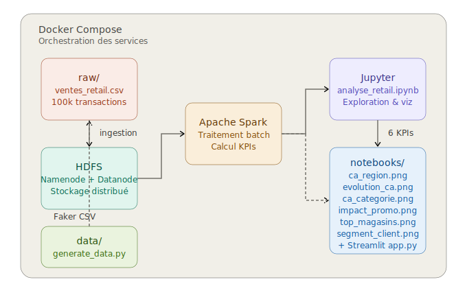
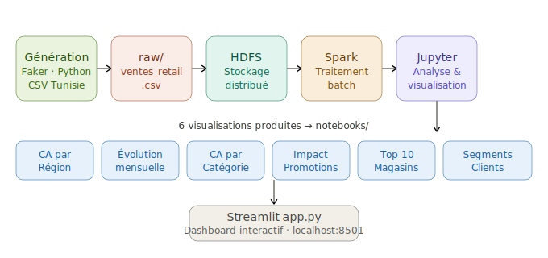

# 🏪 Retail Data Lake — Master FAVD

## Description
Data Lake complet pour l'analyse des ventes retail en Tunisie.
100 000 transactions générées sur 3 ans (2022–2024), stockées dans HDFS et traitées avec Apache Spark.

## Schéma d'architecture


## Flux ETL


## Stack technique
| Composant | Version |
|-----------|---------|
| Hadoop (HDFS) | 3.2.1 |
| Apache Spark | 3.3.0 |
| Python | 3.12 |
| Docker & Docker Compose | latest |
| Streamlit | latest |
| Jupyter | latest |

## Structure du projet
```
retail-datalake/
├── data/
│   └── generate_data.py       # Génération des 100k transactions (Faker)
├── docker/
│   └── docker-compose.yml     # Orchestration des services
├── hdfs/                      # Configuration HDFS
├── notebooks/
│   ├── analyse_retail.ipynb   # Analyse et visualisations
│   ├── ca_region.png
│   ├── evolution_ca.png
│   ├── ca_categorie.png
│   ├── impact_promo.png
│   ├── top_magasins.png
│   └── segment_client.png
├── raw/
│   └── ventes_retail.csv      # Données brutes (100k lignes)
├── spark/                     # Jobs Spark
├── assets/                    # Schémas et diagrammes
├── app.py                     # Dashboard Streamlit
└── README.md
```

## Lancer le projet

### 1. Démarrer les services Docker
```bash
docker-compose -f docker/docker-compose.yml up -d
```

### 2. Générer les données
```bash
python data/generate_data.py
```

### 3. Lancer le dashboard Streamlit
```bash
streamlit run app.py
```
Ouvre ensuite : [http://localhost:8501](http://localhost:8501)

### 4. Accéder à Jupyter
Ouvre : [http://localhost:8888](http://localhost:8888) → `notebooks/analyse_retail.ipynb`

## KPIs calculés (6 visualisations)
| # | KPI | Description |
|---|-----|-------------|
| 1 | CA par Région | Chiffre d'affaires total par région tunisienne |
| 2 | Évolution mensuelle | Tendance du CA mois par mois (2022–2024) |
| 3 | CA par Catégorie | Performance par catégorie de produit |
| 4 | Impact des Promotions | Comparaison CA avec/sans promotion |
| 5 | Top 10 Magasins | Classement des meilleurs magasins par CA |
| 6 | Segments Clients | Répartition du CA par segment client |

## Dashboard interactif
Le dashboard Streamlit permet de filtrer dynamiquement par **région**, **année** et **catégorie** avec mise à jour en temps réel de tous les graphiques.

---
*Master FAVD — Fouille, Analyse et Visualisation des Données*
